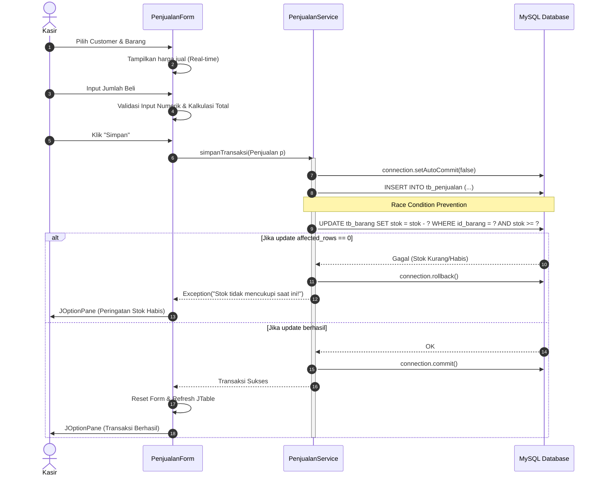

# Arsitektur Aplikasi - Toko Berkah Jaya (Updated)

Sistem Toko Berkah Jaya dirancang menggunakan bahasa pemrograman **Java** dengan arsitektur **3-Tier / MVC (Model-View-Controller)** yang ketat dan aman, disesuaikan dengan pendekatan **Programmatic GUI (Opsi B)** di **NetBeans IDE**.

## 1. Komponen Arsitektur

1. **`database`**:
   - `Koneksi.java`: Menyediakan koneksi ke MySQL. Memiliki fitur manajemen *connection pool* sederhana jika diperlukan, menggunakan pola desain Singleton.

2. **`model`**:
   - Kelas POJO (Plain Old Java Object) representasi tabel database. Terdiri dari: `Barang`, `Customer`, `Kategori`, `Penjualan`, `User`.

3. **`service`** (Controller/DAO Layer - *Business Logic*):
   - Menangani operasi database melalui **PreparedStatement** (mencegah SQL Injection).
   - Menerapkan **Database Transaction** (`setAutoCommit(false)`, `commit`, `rollback`) untuk operasi yang melibatkan lebih dari satu tabel.
   - Menerapkan blok `try-with-resources` untuk mencegah *resource leak* (memori penuh karena koneksi tidak ditutup).

4. **`ui`** (View Layer - *Programmatic Swing*):
   - Murni kode Java tanpa `.form` file.
   - Menggunakan `BorderLayout` dan `GridBagLayout` untuk responsivitas form.
   - Memisahkan thread UI (Event Dispatch Thread / EDT) dari thread pemrosesan data, jika memungkinkan, agar antarmuka tidak *freeze* saat query database lambat.
   - Terdapat event listener (`ItemListener`, `DocumentListener`) untuk merespons perubahan input seketika (seperti kalkulasi total bayar).

5. **`util`**:
   - `Formatter.java`: Utilitas sanitasi input, format mata uang, penanganan *error parsing* agar aplikasi tidak *crash* (`NumberFormatException`).

---

## 2. Aliran Data Transaksi Penjualan Terproteksi (Protected Data Flow)

