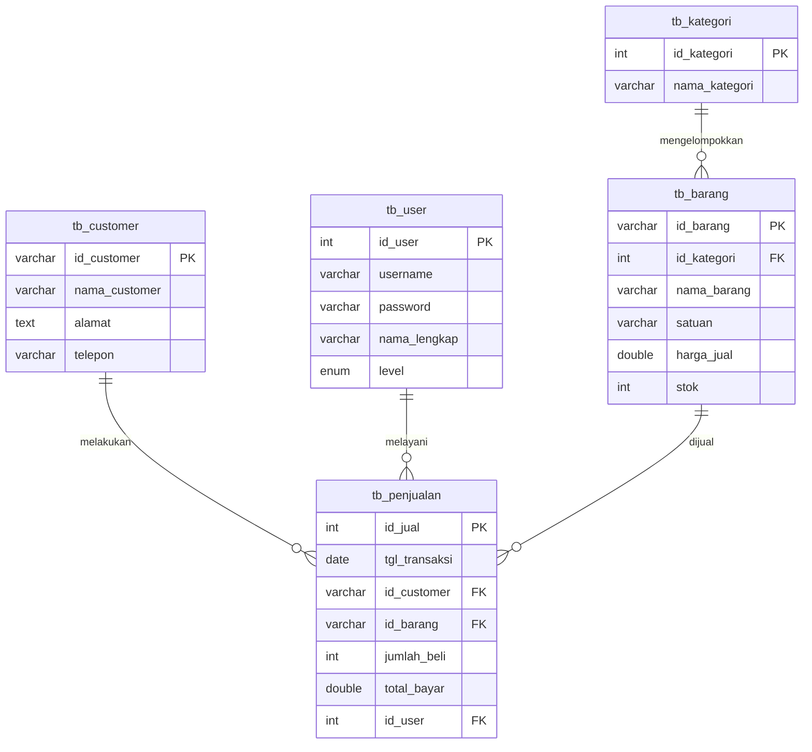

# Arsitektur Database - Toko Berkah Jaya

Sistem menggunakan database relational **MySQL** dengan 5 tabel utama yang saling berelasi.

## 1. Skema Tabel (Tables Schema)

### A. `tb_customer`
Menyimpan data identitas pelanggan tetap.
- **id_customer** (VARCHAR(10), Primary Key)
- **nama_customer** (VARCHAR(100), NOT NULL)
- **alamat** (TEXT)
- **telepon** (VARCHAR(15))

### B. `tb_kategori`
Kategori pengelompokan barang.
- **id_kategori** (INT, Primary Key, AUTO_INCREMENT)
- **nama_kategori** (VARCHAR(50), NOT NULL)

### C. `tb_barang`
Data master barang/produk.
- **id_barang** (VARCHAR(10), Primary Key)
- **id_kategori** (INT, Foreign Key referencing `tb_kategori(id_kategori)`)
- **nama_barang** (VARCHAR(100), NOT NULL)
- **satuan** (VARCHAR(20))
- **harga_jual** (DOUBLE, NOT NULL)
- **stok** (INT, NOT NULL)

### D. `tb_user`
Data pengguna/staf kasir yang mengoperasikan sistem.
- **id_user** (INT, Primary Key, AUTO_INCREMENT)
- **username** (VARCHAR(50), UNIQUE, NOT NULL)
- **password** (VARCHAR(255), NOT NULL)
- **nama_lengkap** (VARCHAR(100), NOT NULL)
- **level** (ENUM('Admin', 'Petugas'), NOT NULL)

### E. `tb_penjualan`
Mencatat transaksi penjualan barang.
- **id_jual** (INT, Primary Key, AUTO_INCREMENT)
- **tgl_transaksi** (DATE, NOT NULL)
- **id_customer** (VARCHAR(10), Foreign Key referencing `tb_customer(id_customer)`)
- **id_barang** (VARCHAR(10), Foreign Key referencing `tb_barang(id_barang)`)
- **jumlah_beli** (INT, NOT NULL)
- **total_bayar** (DOUBLE, NOT NULL)
- **id_user** (INT, Foreign Key referencing `tb_user(id_user)`)

---

## 2. Struktur Relasi (Entity Relationship Diagram - ERD)

